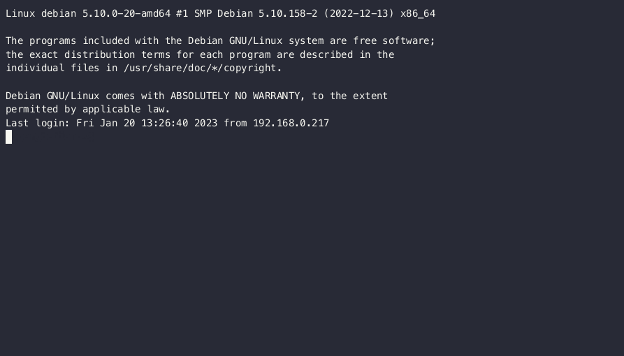

# YAMS - Yet Another Media Server

YAMS is a basic but powerful media server installation script that helps you set up your complete media automation stack with ease.

[Get Started with Installation](install/index.md){ .md-button .md-button--primary }

## What You Get

YAMS automates the installation and configuration of:

- **Plex/Jellyfin/Emby** - Your media server
- **Sonarr** - TV show management
- **Radarr** - Movie management
- **Prowlarr** - Indexer management
- **qBittorrent/SABnzbd** - Download clients
- **Bazarr** - Subtitle management

## Why YAMS?

- **Easy Setup** - One script to rule them all
- **Well Documented** - Step-by-step guides for everything
- **Community Driven** - Active support and development
- **Flexible** - Customize to your needs

Ready to build your media server? Check out the [Installation Guide](install/index.md) to get started!
